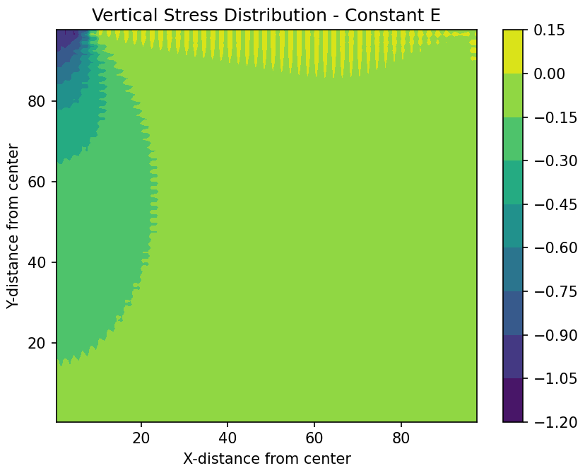

# Finite Element Method Tutorial for Foundation 
> Yongjin Choi

[](https://colab.research.google.com/github/yjchoi1/fem-geotech-tutorial/blob/main/main.ipynb) [](https://opensource.org/licenses/MIT)


## Overview

This repository contains a Python implementation of a 2D finite element method (FEM) analysis for foundation problems. The code simulates the stress distribution in soil under a rigid footing load, accounting for variable soil stiffness with depth.

## Anaysis information

- 2D plane strain analysis using 4-node quadrilateral elements
- Variable elastic modulus with depth
- Gauss quadrature integration (2x2)
- Visualization of vertical stress distribution
- Boundary conditions:
  - Right edge: Fully constrained
  - Bottom edge: Fully constrained  
  - Left edge: Horizontal displacement constrained

## Results

Example stress distribution plot:



The contour plot shows the vertical stress distribution in the soil mass under the footing load. 

## Dependencies

- NumPy
- Matplotlib

## Usage

Run the main script:
```
python main.py
```

Or, we provide Jupyter notebook (`main.ipynb`) that does the same analysis: 
[](https://colab.research.google.com/github/yjchoi1/fem-geotech-tutorial/blob/main/main.ipynb)


